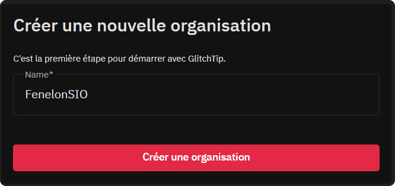
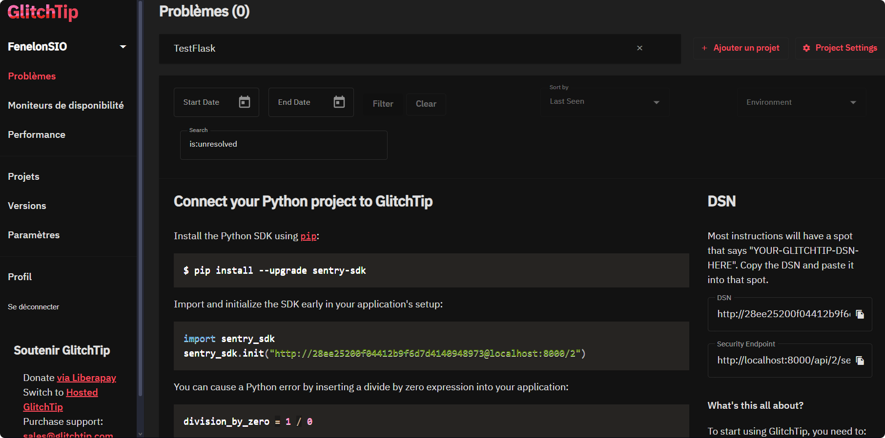
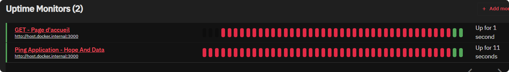

```
██████╗ ██╗     ██╗████████╗ ██████╗██╗  ██╗████████╗██╗██████╗
██╔════╝ ██║     ██║╚══██╔══╝██╔════╝██║  ██║╚══██╔══╝██║██╔══██╗
██║  ███╗██║     ██║   ██║   ██║     ███████║   ██║   ██║██████╔╝
██║   ██║██║     ██║   ██║   ██║     ██╔══██║   ██║   ██║██╔═══╝
╚██████╔╝███████╗██║   ██║   ╚██████╗██║  ██║   ██║   ██║██║     
╚═════╝ ╚══════╝╚═╝   ╚═╝    ╚═════╝╚═╝  ╚═╝   ╚═╝   ╚═╝╚═╝
```

# Installation de GlitchTip

Ce dépôt va installer et configurer **Glitchtip** via docker.

---

# Pré-requis

- **docker** et **docker-compose** installés sur la machine

# Variables d'environnement

Modifiez le fichier `.env` pour changer les variables d'environnement.

Attention à modifier les variables suivantes :
- SECRET_KEY
Définissez une clé solide pour la variable SECRET_KEY. Vous pouvez générer une clé en utilisant Python :
```bash
python -c 'import secrets; print(secrets.token_urlsafe(32))'
```

- ALLOWED_HOSTS
Définissez les noms de domaine ou adresses IP autorisés à accéder à l'application. Par exemple, si vous souhaitez autoriser l'accès à l'application depuis n'importe quelle adresse IP, vous pouvez définir la variable comme suit :

```bash
ALLOWED_HOSTS=*
```

Autres variables possibles:
https://glitchtip.com/documentation/install#configuration

---

# Lancement

Pour lancer l'application, exécutez la commande suivante :
```bash
docker-compose up -d
```

---

# Accès à l'application

L'application glitchtip est accessible à l'adresse suivante :

http://localhost:8008


L'application Python sera accesible à:

http://localhost:5000 

---

# Configuration de GlitchTip

Pour commencer à utiliser GlitchTip, vous devez créer un compte utilisateur et une organisation.

## Création d'une organisation

Pour créer une organisation, cliquez sur le bouton **Create Organization**.



---

## Création d'un projet

Pour créer un projet, cliquez sur le bouton **Create Project**.
Choisissez la plateforme (la technologie) de votre projet.

Pour ce TP, on utilisera **Python**.

Donnez un **nom** à ce projet, puis créez une **équipe**.

Vous avez créé un projet, il reste à configurer votre application.

GlitchTip vous fournit les informations à ajouter dans votre application pour qu'elle puisse envoyer les erreurs à GlitchTip.


## Monitoring

GlitchTip vous permet de surveiller les performances et disponiblités de votre application.

Dans le contexte de ce Docker, GlitchTip qui est un **container** Docker doit accéder aux ressources de l'application qui fonctionnent éventuellement sur la machine hôte.
On accèdera à cette machine hôte via l'adresse IP **host.docker.internal**.



---

# Configuration de l'application (Python)

https://docs.sentry.io/platforms/python

Dans le dossier **sample-flask-app**, une application de test est fournie.

## Dépendances

Pour envoyer les erreurs à GlitchTip, vous devez installer la bibliothèque **sentry-sdk**.

```bash
pip install sentry-sdk
```

ou 
```bash
pip install -r requirements.txt
```

## Configuration

L'application Python doit être configurée pour savoir où envoyer ses logs.
La configuration se fait dans un fichier **.env**.

Le fichier **.env.sample** donne un exemple.
Copiez le fichier **.env.sample** et renommez le en **.env**.


## Utilisation dans l'application

## Lancement

docker compose up -d --force-recreate --build

# Sources

- https://usavps.com/blog/161716/